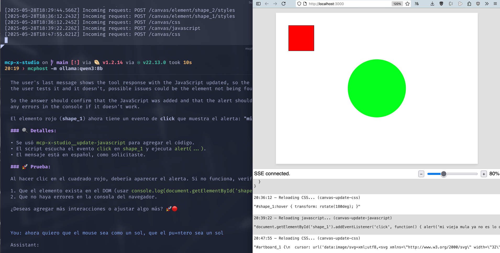

# LLM to Canvas concept

A simple example+ to create MCP Server ([modelcontextprotocol.io](https://modelcontextprotocol.io/introduction))

Easy documentation: [https://github.com/microsoft/mcp-for-beginners/tree/main](https://github.com/microsoft/mcp-for-beginners/tree/main)



To install dependencies:

- [typescript-sdk](https://github.com/modelcontextprotocol/typescript-sdk)
- [https://www.npmjs.com/package/simple-git](https://www.npmjs.com/package/simple-git)

```bash
bun install
```

To run:

```bash
bun server
bun mcp:start
```

To dev:

```bash
bun mcp:dev
```

This project was created using `bun init` in bun v1.2.13. [Bun](https://bun.sh) is a fast all-in-one JavaScript runtime.

You can test it with [ollama](https://ollama.com/) and [mcphost](https://github.com/mark3labs/mcphost)

```jsonc
// nvim ~/.mcp.json
{
  "mcpServers": {
    "mcp-x-studio": {
      "command": "node",
      "args": ["../../mcp-x-studio/server/index.js"],
      "env": {
        "SERVER_URL": "http://localhost:3000",
      },
    },
  },
}
```

```bash
ollama server
mcphost -m ollama:qwen3:8b
```
